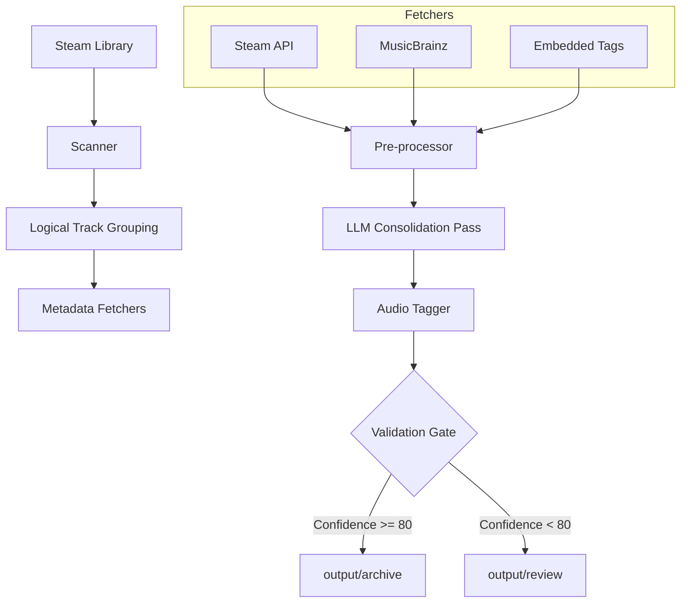

# SST System Architecture (Act-11)

Steam Soundtrack Tagger (SST) is a hybrid metadata processing pipeline that combines high-speed programmatic analysis with LLM-based reasoning to ensure high-fidelity ID3 tagging for game soundtracks.

## 1. High-Level Workflow

The system operates in four distinct phases:

### Phase 1: Scanner & Source Collection
- **Steam Library Scan**: Identifies installed soundtracks using `.acf` files.
- **File Grouping**: Groups physical files into "Logical Tracks" by normalizing filenames.
- **Embedded Extraction**: Extracts existing ID3/Vorbis/FLAC tags from local files.

### Phase 2: Deterministic Pre-processing
- **Cross-Validation**: Python logic compares tags across formats. Identical metadata is flagged as "Strong Evidence."
- **MusicBrainz (MBZ) Scoring**: The system searches MBZ and ranks candidates using strict scoring rules (Title, Track Count, Format).
- **Context Slimming**: Metadata is pruned and weighted before being sent to the AI.

### Phase 3: All-in-One LLM Consolidation
- **Batch Processing**: Instead of track-by-track requests, the entire album context is sent in a single LLM request.
- **Reasoning**: The LLM resolves conflicts based on the provided evidence weights.
- **Self-Evaluation**: The LLM outputs a `confidence_score` (0-100) reflecting the reliability of the match.

### Phase 4: Tagger & Routing
- **Standardized Tagging**: Applies ID3v2.3 tags with UTF-16 BOM encoding.
- **Artwork Acquisition**: Downloads and processes official covers to 500x500 PNG.
- **Strict Gating**: Automatically routes to `archive/` (Score >= 80) or `review/` (Score < 80 or incomplete data).

## 2. Component Diagram

## 3. Data Integrity & "Locking Truth"
Deterministic fields that are never subject to AI "guessing":
- **AppID / Store URL**
- **Developer / Publisher**
- **Parent Game Name**
- **Genre Prefix (STEAM VGM)**
- **ID3 Encoding (UTF-16 BOM)**
