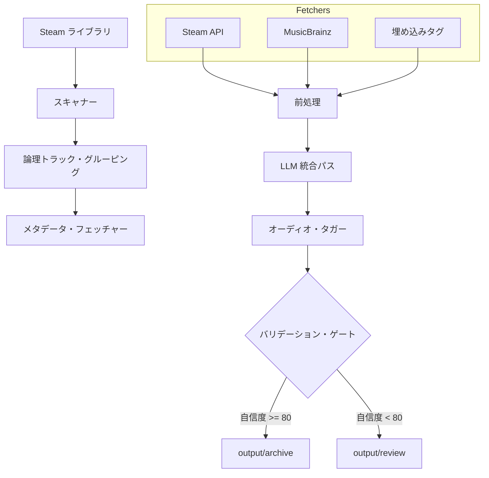

# SST システム・アーキテクチャ (Act-11)

Steam Soundtrack Tagger (SST) は、高速なプログラム分析と LLM ベースの推論を組み合わせたハイブリッド・メタデータ処理パイプラインです。ゲーム・サウンドトラックに対して高精度な ID3 タグ付けを実現します。

## 1. ワークフローの概要

システムは以下の 4 つのフェーズで動作します。

### フェーズ 1: スキャナーとソース収集
- **Steam ライブラリ・スキャン**: `.acf` ファイルを使用してインストール済みのサウンドトラックを特定します。
- **ファイル・グルーピング**: ファイル名を正規化することで、物理ファイルを「論理トラック」にグループ化します。
- **埋め込みタグ抽出**: ローカルファイルから既存の ID3/Vorbis/FLAC タグを抽出します。

### フェーズ 2: 確定的前処理
- **相互検証 (Cross-Validation)**: Python ロジックがフォーマット間でタグを比較します。一致するメタデータは「強い証拠 (Strong Evidence)」としてフラグ付けされます。
- **MusicBrainz (MBZ) スコアリング**: MBZ を検索し、厳格なスコアリング・ルール（タイトル、トラック数、フォーマット）に基づいて候補をランク付けします。
- **コンテキスト・スリミング**: AI に送信する前に、メタデータを剪定し、重み付けを行います。

### フェーズ 3: All-in-One LLM 統合
- **バッチ処理**: トラックごとのリクエストではなく、アルバム全体のコンテキストを 1 回の LLM リクエストで送信します。
- **推論**: LLM は、提供された証拠の重みに基づいて矛盾を解決します。
- **自己評価**: LLM は、同定の信頼性を反映した `confidence_score` (0-100) を出力します。

### フェーズ 4: タガーと振り分け
- **標準化されたタグ付け**: ID3v2.3 タグを UTF-16 BOM エンコーディングで適用します。
- **アートワーク取得**: 公式カバーをダウンロードし、500x500 の PNG に加工します。
- **厳格なゲート機能**: 自信度スコア（80 以上）または不完全なデータに基づいて、自動的に `archive/` または `review/` に振り分けます。

## 2. コンポーネント図

## 3. データの整合性と「確定真実」
AI の「推測」対象とならない確定的なフィールド：
- **AppID / ストア URL**
- **開発元 / パブリッシャー**
- **親ゲーム名**
- **ジャンル接頭辞 (STEAM VGM)**
- **ID3 エンコーディング (UTF-16 BOM)**
