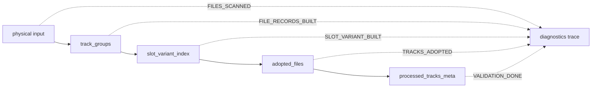

# S.S.T 改善提案の具体仕様（検証を弱めない）

> 正本レポート: `report/sst_200_batch_investigation_and_improvement_proposal.html` 第7章
> 本ドキュメントは、第7章の7項目を実装可能な仕様へ具体化したものである。既存の監査契約（[`docs/audit_and_intermediate_artifacts.md`](audit_and_intermediate_artifacts.md)）とメタデータ正本（[`docs/METADATA_SOURCE_SPEC.md`](METADATA_SOURCE_SPEC.md)）を拡張し、**検証を弱めない**ことを最上位制約とする。

---

## 1. 目的

200件実データテスト後調査で判明した構造的可観測性・監査網羅性・効率性の改善点を、次の不変契約のもとで実装する。

- Archive判定は「LLMが高信頼度」だけでは成立しない。最終ファイル・タグ・Steam slot・件数の物理 preflight を通過して初めて成立する。
- Review判定を弱める方向（閾値一律緩和、重複検証緩和、自動採番、Steam構造のローカル名置換、物理破損の警告格下げ）は**一切採用しない**。
- 追加される全フィールドは監査JSON・`llm_log.json`・DB metadata に構造化保存され、将来の回帰テストで契約検証できる。

---

## 2. ギャップ分析（現行コードとの差分）

| # | 提案 | 現状 | ギャップ |
|---|------|------|----------|
| 1 | 構造化原因の完全保存 | [`validator.py`](../src/sst/validator.py:172) で `primary_review_cause` / `secondary_review_causes` を保存。Early Review経路は [`processor_pipeline.py`](../src/sst/processor_pipeline.py:39) で `review_cause_code` のみ保存 | Early Reviewの `summary_meta` に `audit` ブロック・primary/secondary cause が**未保存**。レポートで指摘された diagnostics欠落1件に該当 |
| 2 | slot単位の収集数診断 | [`track_grouper.py`](../src/sst/track_grouper.py:117) → [`build_slot_variant_index`](../src/sst/processor_support.py:30) → [`adopt_best_file_per_slot`](../src/sst/processor_support.py:76) → [`_normalize_processed_tracks`](../src/sst/processor.py:655) の件数が `_diag` と `audit` に部分的にしか存在しない | `physical input → track_groups → slot_variant_index → adopted_files → processed_tracks_meta` の**各段階件数の連続記録**がない |
| 3 | LLM矛盾の拒否を明示 | [`_normalize_track_mapping_result`](../src/sst/llm/organizer.py:261) が Steamにない slot を `continue` で黙殺、[`_build_slot_view`](../src/sst/llm/organizer.py:329) が未知file_id・重複を黙って除外 | 矛盾の**検出事実**が Review 理由・診断に残らない。自動修正で隠す構造 |
| 4 | Fast-Track回帰fixture | [`test_fast_track.py`](../tests/test_fast_track.py) に基本ケース・スロット欠落のみ | AIF/MP3同一slot variant、HTML実体参照、単曲アルバム、Steam track番号異常、最終1slot=1採用の**固定fixture**がない |
| 5 | I/O再試行の観測 | [`copy_with_retry`](../src/sst/processor_tracks.py:15) が失敗種別・試行回数・最終状態を返さない。`failed` フラグのみ | 再試行の構造化記録がなく、再試行成功がArchive昇格理由にならない契約がコード上で検証できない |
| 6 | 高速化・LLM計測 | [`client.py`](../src/sst/llm/client.py:266) の `LLM_REQUEST_DONE` で `wait_seconds: 0` 固定。prompt cache情報は `meta` に一部のみ | `wait_seconds` 実測、prompt cacheヒット判定、load/eval duration、SST側で相関可能な匿名IDが未記録 |
| 7 | 処理の重複削減 | [`ScannerCacheManager`](../src/sst/scanner_cache.py:9) は enriched/タグのみ。LLM抽出・identity結果のキャッシュなし | 同一入力の `steam_tracklist_extraction` / `identity` が毎回LLM呼び出し。TTL・入力ハッシュ・監査記録が未実装 |

---

## 3. 提案1: 構造化原因の完全保存

### 3.1 現状と問題

通常経路（[`processor.py`](../src/sst/processor.py:526)）は `audit` ブロックを保存するが、Early Review経路（[`processor_pipeline.py`](../src/sst/processor_pipeline.py:51)）の `summary_meta` は `app_id / album_name / status / message / confidence / tracks / steam_info / diagnostics` のみで、`audit` と `primary_review_cause` が欠落する。レポートの「Review 41件中40件に primary_review_cause があり、1件は構造化diagnostics欠落」はこの経路で発生した可能性が高い。

### 3.2 仕様

1. **Early Review経路の `summary_meta` に `audit` ブロックを必須追加**（値は次のとおり）:

```json
{
  "audit": {
    "steam_expected_slots": 12,
    "final_adopted_slots": 0,
    "final_duplicate_slots": 0,
    "steam_legitimate_unknown": 0,
    "anomalous_unknown": 0,
    "input_file_count": 12,
    "adopted_file_count": 0,
    "unassigned_file_count": 12,
    "archive_artifact_issues": [],
    "review_phase": "EARLY_REVIEW"
  }
}
```

2. **`diagnostics` への構造化保存の統一**（通常経路・Early Review経路共通）:

```json
{
  "review_cause_code": "EARLY_REVIEW_RETURN",
  "upstream_cause_code": "LLM_RESPONSE_MISSING",
  "primary_review_cause": "LLM Failure: No LLM response",
  "secondary_review_causes": [],
  "steam_expected_slots": 12,
  "adopted_slots": 0,
  "unassigned_slots": 12
}
```

- `steam_expected_slots`: `len(steam_meta.store_tracklist or [])`
- `adopted_slots`: `len(processed_tracks_meta)`（Early Reviewは `0`）
- `unassigned_slots`: `steam_expected_slots - adopted_slots`（マイナスは `0` にクランプしない。実測値を記録）

3. **回帰テスト**: レポートの「diagnostics欠落1件」を再現する fixture（Early Review を直接呼び出し、`summary_meta["audit"]` と `diagnostics["primary_review_cause"]` の存在を検証）。

### 3.3 変更対象

- [`src/sst/processor_pipeline.py`](../src/sst/processor_pipeline.py)
- [`src/sst/processor.py`](../src/sst/processor.py)（`audit` ブロックの `review_phase` 追加）
- [`src/sst/validator.py`](../src/sst/validator.py)（`steam_expected_slots` 等の diagnostics 追加）
- [`tests/test_audit_contracts.py`](../tests/test_audit_contracts.py)（Early Review の監査契約テスト追加）

### 3.4 受け入れ条件

- Early Review の成果物ZIPの `metadata.json` に `audit` と `diagnostics.primary_review_cause` が必ず存在する。
- `test_audit_contracts.py` の新規テストがパスする。
- Archive率・Review率の判定ロジックは変更しない。

---

## 4. 提案2: slot単位の収集数診断

### 4.1 仕様

次のパイプライン段階の件数を `_diag` に記録し、最終 `summary_meta["audit"]` にも集約保存する。未割当・重複・欠落の**発生境界**を特定できるようにする。



| 段階 | `_diag` ステージ名 | 記録内容 | 既存 |
|------|-------------------|----------|------|
| 物理入力 | `FILES_SCANNED` | `audio_file_count` | あり |
| 論理グループ | `FILE_RECORDS_BUILT` | `file_count`（track_groups数） | あり |
| slot集約 | `SLOT_VARIANT_BUILT`（**新規**） | `slot_count`, `variant_count`, `multi_variant_slot_count` | なし |
| 採用決定 | `TRACKS_ADOPTED`（**新規**） | `adopted_slot_count`, `adopted_file_count` | なし |
| 最終正規化 | `VALIDATION_DONE` | `processed_track_count` | あり |

`summary_meta["audit"]` に次を追加（既存キーは維持）:

```json
{
  "track_group_count": 12,
  "slot_variant_count": 12,
  "multi_variant_slot_count": 3,
  "adopted_slot_count": 12,
  "io_retry_count": 0
}
```

- `multi_variant_slot_count`: 同一slotに2つ以上の物理ファイル（AIF/MP3等）が集約されたslot数。形式variantの存在を可視化する。

### 4.2 変更対象

- [`src/sst/processor.py`](../src/sst/processor.py)（`_diag("SLOT_VARIANT_BUILT")` / `_diag("TRACKS_ADOPTED")` 追加、audit拡張）
- [`src/sst/processor_support.py`](../src/sst/processor_support.py)（件数計算ヘルパーを返す拡張、または呼び出し側での集計）
- [`tests/test_audit_contracts.py`](../tests/test_audit_contracts.py)

### 4.3 受け入れ条件

- Archive・Review双方の `metadata.json["audit"]` に全キーが存在する。
- 件数の不整合（例: `adopted_slot_count` > `slot_variant_count`）を検出するテストが追加される。

---

## 5. 提案3: LLM矛盾の拒否を明示

### 5.1 現状の問題

[`_normalize_track_mapping_result`](../src/sst/llm/organizer.py:261) は `_resolve_slot_key_to_v_idx` が `None` を返したslot（Steamに存在しないslot）を `continue` で黙殺する。[`_build_slot_view`](../src/sst/llm/organizer.py:329) は `known_file_ids` 外のfile_idと重複file_idを黙って除外する。この結果、**矛盾の検出事実が診断に残らない**。

### 5.2 仕様

1. **正規化層で矛盾を集計**し、`alignment_res["diagnostics"]` へ追加する（`_build_alignment_diagnostics` の返り値拡張）:

```json
{
  "rejected_slot_keys": ["9", "13"],
  "rejected_slot_reason": "not_in_steam_tracklist",
  "rejected_file_ids": ["abc123", "def456"],
  "rejected_file_reason": "unknown_or_duplicate_assignment",
  "duplicate_assignment_file_ids": ["abc123"]
}
```

2. **Review理由への反映**: 矛盾が1件でも存在する場合は `validator.py` の `issues` へ次を追加し、Reviewへ導く（Archive判定を矛盾で覆さない）。

- `rejected_slot_keys` あり → `LLM Rejected Slots (N)`（Nは件数）
- `duplicate_assignment_file_ids` あり → `LLM Duplicate Assignment (N)`

3. **自動修正の禁止**: 矛盾を黙って捨てる・1対1へ強制修正してArchive判定に昇格させることはしない。矛盾は常に監査JSONとReviewメッセージへ明示する。

4. **Fast-Trackは対象外**: 決定論的Fast-Track（[`_check_fast_track`](../src/sst/processor.py:187)）はLLMを経由しないため、本仕様の対象外とする。ただしFast-Track由来の割当も最終 `processed_tracks_meta` でslot重複が残れば従来どおりReviewとする（変更なし）。

### 5.3 変更対象

- [`src/sst/llm/organizer.py`](../src/sst/llm/organizer.py)（`_normalize_track_mapping_result` / `_build_slot_view` / `_build_alignment_diagnostics`）
- [`src/sst/validator.py`](../src/sst/validator.py)（alignment diagnostics からの issues 生成）
- [`tests/test_llm_slot_correlation.py`](../tests/test_llm_slot_correlation.py)（矛盾検出・Review反映テスト）

### 5.4 受け入れ条件

- LLMがSteamにないslotを返した場合、Reviewになり、`rejected_slot_keys` が監査JSONに残る。
- 1ファイルが複数slotへ割り当てられた場合、Reviewになり、`duplicate_assignment_file_ids` が残る。

---

## 6. 提案4: Fast-Track回帰fixture

### 6.1 仕様

[`tests/test_fast_track.py`](../tests/test_fast_track.py) に次の**匿名合成fixture**を追加し、最終状態が「1slot = 1採用ファイル」であることを検証する。

| fixture | 入力条件 | 期待結果 |
|---------|----------|----------|
| `test_fast_track_accepts_format_variants_in_same_slot` | 同一slotに AIF + MP3（duration差 < 1.0s） | Fast-Track成功。slot_variant_index のvariant数2、採用はAIF 1件 |
| `test_fast_track_handles_html_entity_titles` | Steam title が `Ryu & Ken`、ローカルが `Ryu & Ken`（`html.unescape` で正規化） | Fast-Track成功 |
| `test_fast_track_single_track_album` | Steam slot 1件 + ローカル1件 | Fast-Track成功。slot数一致 |
| `test_fast_track_rejects_abnormal_steam_numbers` | Steam track number が `1/2` 形式や非数字を含む | `_build_fast_track_slot_map` が `None` を返し Fast-Track 不採用（LLM経路へ） |
| `test_fast_track_final_one_file_per_slot` | 上記fixture成功時、`adopt_best_file_per_slot` の返り値が slot数と一致し、各slotに1ファイル | 1:1 を固定 |

- fixtureのファイルは `tmp_path` に実ファイルを書かず、`track_groups` 構造の合成dictで構築する（既存テストと同方式）。
- Steam track番号異常の定義: `_normalize_slot_key` で正規化できない番号、またはslot重複（同一disc/trackキー）を含むtracklist。

### 6.2 変更対象

- [`tests/test_fast_track.py`](../tests/test_fast_track.py)
- 必要に応じ [`src/sst/processor_support.py`](../src/sst/processor_support.py) の `adopt_best_file_per_slot` のテスト用ヘルパー

### 6.3 受け入れ条件

- 新規5テストがパスする。
- 既存のFast-Track判定ロジックは変更しない（fixture追加のみ）。

---

## 7. 提案5: I/O再試行の観測

### 7.1 仕様

[`copy_with_retry`](../src/sst/processor_tracks.py:15) を、試行の構造化記録を返す形へ変更する（呼び出し側 [`process_single_track`](../src/sst/processor_tracks.py:87) の挙動は維持）。

```json
{
  "io_retry_log": {
    "source": "01 Main Theme.flac",
    "attempts": [
      {"attempt": 1, "error_type": "PermissionError", "error": "Permission denied", "success": false},
      {"attempt": 2, "error_type": null, "error": null, "success": true}
    ],
    "final_state": "success",
    "retried": true
  }
}
```

- `final_state`: `success`（成功）/ `failed`（最終失敗）
- 失敗種別: 例外クラス名（`OSError` / `IOError` / `PermissionError` 等）を `error_type` に記録
- `process_single_track` の返り値に `io_retry_log` を追加し、[`processor.py`](../src/sst/processor.py:487) で集計して `summary_meta["audit"]["io_retry_count"]` と `io_retry_logs`（最大5件）に保存する。

### 7.2 検証を弱めない契約（明文化）

- **再試行成功を無条件にArchive根拠へ昇格させない。**
- 再試行後のコピー成功は通常の入力として扱うだけで、`validator.py` の `audio_fail` / `audio_warn`（変換・エンコード失敗）判定は従来どおり有効。
- 最終コピーが失敗したトラックは `failed=True` となり、`ResultValidator.validate` の `audio_fail` を経て Review になる（現行契約を維持）。
- 変換後に出力ファイルが0バイト・不存在の場合は `_validate_archive_artifacts`（[`processor.py`](../src/sst/processor.py:610)）が既に検出する。これを警告だけへ格下げしない。

### 7.3 変更対象

- [`src/sst/processor_tracks.py`](../src/sst/processor_tracks.py)
- [`src/sst/processor.py`](../src/sst/processor.py)
- [`tests/test_runner_resilience.py`](../tests/test_runner_resilience.py)（再試行記録のテスト追加）

### 7.4 受け入れ条件

- 再試行を要したトラックの `io_retry_log` が `metadata.json` に保存される。
- 再試行成功だけでArchiveへ昇格する経路が存在しないことをテストで検証（`audio_fail=True` ならReviewのまま）。

---

## 8. 提案6: 高速化・LLM計測の構造化

### 8.1 仕様

[`client.py`](../src/sst/llm/client.py) の `_call_llm` を拡張する。

1. **Ollamaレスポンスの計測フィールドを `meta` へ保存**（レスポンスに存在する場合のみ）:

```json
{
  "meta": {
    "done": true,
    "done_reason": "stop",
    "prompt_eval_count": 1234,
    "eval_count": 456,
    "load_duration_ns": 1000000,
    "prompt_eval_duration_ns": 500000000,
    "eval_duration_ns": 3000000000,
    "total_duration_ns": 3500000000
  }
}
```

2. **`wait_seconds` の実測**: リクエスト開始からHTTP POSTまでの実経過時間（レートリミット・VRAM待機・キューの順番待ちを含む）を計測し、`LLM_REQUEST_DONE` の `wait_seconds` に固定値 `0` をやめ実測値を記録する。

3. **prompt cacheヒット判定**: `prompt_eval_count` が入力プロンプトの推定token数より有意に小さい場合（`prompt_eval_count < expected_prompt_tokens * 0.9`）に `cache_hit: true` を記録。`expected_prompt_tokens` は `_estimate_expected_output_tokens` と同系統の概算関数を新設して算出（正確なtokenizerは不要、傾向値として監査用途）。

4. **匿名相関ID**: `request_id` を生成し、`llm_log.json` の各 `log_entry` と `LLM_REQUEST_DONE` のログ行の両方に記録する。形式: `sha1(f"{app_id}:{request_kind}:{monotonic_ns}")[:12]`。AppID・実パス・モデルファイル名は含めない。

5. **Fast-Track対象の構造的安全な限定**: 既存のFast-Track判定条件（[`_check_fast_track`](../src/sst/processor.py:187)）を変更しない。高速化の計測対象は「LLMが呼ばれた102 AppID」のリクエストのみとする。

### 8.2 変更対象

- [`src/sst/llm/client.py`](../src/sst/llm/client.py)
- [`src/sst/llm/organizer.py`](../src/sst/llm/organizer.py)（`request_id` の伝播）
- [`tests/test_llm_parallelism.py`](../tests/test_llm_parallelism.py)（計測フィールドの契約テスト）

### 8.3 受け入れ条件

- `LLM_REQUEST_DONE` に `wait_seconds`（実測）、`cache_hit`、`request_id` が含まれる。
- `llm_log.json` の各 `log_entry` に同一 `request_id` が含まれる。

---

## 9. 提案7: 処理の重複削減（LLM結果キャッシュ）

### 9.1 仕様

同一入力の `steam_tracklist_extraction` と `identity` のLLM結果を、TTL付きでキャッシュする。キャッシュ利用時は監査記録を残し、異なるSteam構造を誤って共有しない境界テストを追加する。

1. **キャッシュキー**: `sha256(input_text) の先頭16文字 + ":" + request_kind + ":" + user_language`。
   - `steam_tracklist_extraction`: `input_text = description_text`（Steamストア説明文の正規化後）
   - `identity`: `input_text = プロンプト生成に使う主要シグナル`（`s_steam + s_fingerprint + s_mbz_search + s_local` を正規化して連結）
2. **TTL**: キャッシュ保存時刻から `SST_LLM_CACHE_TTL_SECONDS`（既定 `86400` = 24時間）を超えたら無効。
3. **保存先**: `data/llm_cache.json`（`ScannerCacheManager` と同形式のJSON）。書き込みはアトミック（一時ファイル→rename）。
4. **監査記録**: キャッシュヒット時、`llm_log.json` の該当 `log_entry` に次を記録:

```json
{
  "cache": {
    "hit": true,
    "request_kind": "steam_tracklist_extraction",
    "input_hash": "a1b2c3d4e5f6a1b2",
    "saved_at": "2026-08-18T22:00:00+09:00",
    "ttl_seconds": 86400
  }
}
```

5. **共有境界の防止**: キャッシュキーに `user_language` を含めることで、言語違いの抽出結果を共有しない。`identity` は同じAppIDでも入力シグナルが異なる場合は別キーになるため、誤共有しない。
6. **無効化スイッチ**: `SST_LLM_CACHE_ENABLED=false`（既定 `true`）で完全無効化できる。

### 9.2 境界テスト

| テスト | 条件 | 期待 |
|--------|------|------|
| `test_llm_cache_hit_returns_same_result` | 同一入力・同一言語・TTL内で2回呼び出し | 2回目はLLM呼び出しなし、`cache.hit=true` |
| `test_llm_cache_misses_on_different_language` | 言語だけ異なる同一入力 | キャッシュミス、`cache.hit=false` |
| `test_llm_cache_expires_after_ttl` | TTL超過 | キャッシュミス |
| `test_llm_cache_does_not_share_across_inputs` | 入力ハッシュが異なる | キャッシュミス |

### 9.3 変更対象

- [`src/sst/llm/organizer.py`](../src/sst/llm/organizer.py)（`extract_steam_tracklist` / `consolidate_alignment_inputs` のidentity呼び出し）
- 新規: [`src/sst/llm/llm_cache.py`](../src/sst/llm/llm_cache.py)
- [`src/sst/config.py`](../src/sst/config.py)（`sst_llm_cache_enabled` / `sst_llm_cache_ttl_seconds` / `sst_llm_cache_path`）
- 新規テスト: [`tests/test_llm_cache.py`](../tests/test_llm_cache.py)

### 9.4 受け入れ条件

- キャッシュ利用は `cache.hit` として監査JSONに残り、**LLM結果が無条件に再利用されることを「非表示の自動修正」にしない**（キャッシュも通常のLLM結果と同様に `_normalize_*` 層と validator を通過する）。
- 同一キーであれば再現性があり、言語・入力ハッシュ違いで共有されない。

---

## 10. 実装フェーズ用TODOリスト

実装モード（Code）へ引き継ぐための順序付きタスク。各タスクは本仕様の対応節を参照する。

- [ ] 1. 提案1: [`src/sst/processor_pipeline.py`](../src/sst/processor_pipeline.py) の `summary_meta` へ `audit` ブロック追加、`diagnostics` の構造化統一（§3）
- [ ] 2. 提案1: [`src/sst/validator.py`](../src/sst/validator.py) へ `steam_expected_slots` / `adopted_slots` / `unassigned_slots` を diagnostics 追加（§3）
- [ ] 3. 提案1: [`tests/test_audit_contracts.py`](../tests/test_audit_contracts.py) に Early Review 監査契約テスト追加（§3.3）
- [ ] 4. 提案2: [`src/sst/processor.py`](../src/sst/processor.py) へ `SLOT_VARIANT_BUILT` / `TRACKS_ADOPTED` の `_diag` 追加（§4）
- [ ] 5. 提案2: `summary_meta["audit"]` へ `track_group_count` / `slot_variant_count` / `multi_variant_slot_count` / `adopted_slot_count` / `io_retry_count` 追加（§4）
- [ ] 6. 提案2: 件数不整合検出テスト追加（§4.3）
- [ ] 7. 提案3: [`src/sst/llm/organizer.py`](../src/sst/llm/organizer.py) の `_normalize_track_mapping_result` / `_build_slot_view` で拒否slot・拒否file・重複を集計（§5）
- [ ] 8. 提案3: `_build_alignment_diagnostics` へ `rejected_slot_keys` / `rejected_file_ids` / `duplicate_assignment_file_ids` 追加（§5.2）
- [ ] 9. 提案3: [`src/sst/validator.py`](../src/sst/validator.py) で `LLM Rejected Slots (N)` / `LLM Duplicate Assignment (N)` を issues 追加（§5.2）
- [ ] 10. 提案3: [`tests/test_llm_slot_correlation.py`](../tests/test_llm_slot_correlation.py) へ矛盾検出・Review反映テスト追加（§5.4）
- [ ] 11. 提案4: [`tests/test_fast_track.py`](../tests/test_fast_track.py) へ5種類の回帰fixture追加（§6.1）
- [ ] 12. 提案5: [`src/sst/processor_tracks.py`](../src/sst/processor_tracks.py) の `copy_with_retry` を構造化記録返却へ変更（§7）
- [ ] 13. 提案5: [`src/sst/processor.py`](../src/sst/processor.py) で `io_retry_count` / `io_retry_logs` を audit へ集約（§7）
- [ ] 14. 提案5: [`tests/test_runner_resilience.py`](../tests/test_runner_resilience.py) に再試行記録テスト追加（§7.4）
- [ ] 15. 提案6: [`src/sst/llm/client.py`](../src/sst/llm/client.py) で `load_duration_ns` 等の計測フィールド保存、`wait_seconds` 実測、`cache_hit` 判定、`request_id` 生成（§8）
- [ ] 16. 提案6: [`src/sst/llm/organizer.py`](../src/sst/llm/organizer.py) で `request_id` を `llm_log.json` の各 `log_entry` へ伝播（§8）
- [ ] 17. 提案6: [`tests/test_llm_parallelism.py`](../tests/test_llm_parallelism.py) へ計測フィールド契約テスト追加（§8.3）
- [ ] 18. 提案7: 新規 [`src/sst/llm/llm_cache.py`](../src/sst/llm/llm_cache.py) 実装（§9）
- [ ] 19. 提案7: [`src/sst/config.py`](../src/sst/config.py) へ `sst_llm_cache_enabled` / `sst_llm_cache_ttl_seconds` / `sst_llm_cache_path` 追加（§9.3）
- [ ] 20. 提案7: 新規 [`tests/test_llm_cache.py`](../tests/test_llm_cache.py) で境界テスト4件実装（§9.2）
- [ ] 21. 全体: `pytest` 全件パス、Ruffパス、[`docs/audit_and_intermediate_artifacts.md`](audit_and_intermediate_artifacts.md) との契約整合を確認（§11）
- [ ] 22. 全体: `CHANGE_HISTORY.md` 先頭へ変更記録を追記

---

## 11. 不変契約（禁止事項の再確認）

第7章の「禁止事項」を仕様として固定する。本仕様の実装では次のいずれも行わない。

- Archive率を上げる目的でconfidence閾値を一律に下げる（[`validator.py`](../src/sst/validator.py:157) の `llm_archive_path` / `steam_trust_path` の閾値は変更しない）。
- 重複検証を緩める（`_normalize_processed_tracks` の slot 重複排除ロジックは変更しない。形式variantの統合は既存どおり）。
- 曖昧なtrackを自動採番する（`_normalize_slot_key` で正規化できないtrackへの強制採番は追加しない）。
- Steam構造をローカルファイル名で置換する（builder の STEAM 優先は変更しない）。
- 物理破損を警告だけに格下げする（`audio_fail` → Review、`_validate_archive_artifacts` のpreflight失敗 → Review を維持）。
- 再試行成功を無条件にArchive根拠へ昇格する（§7.2）。
- LLM矛盾を自動修正で隠してArchive判定する（§5.2-3）。

## 12. 変更履歴

- 2026/08/18: レポート第7章の7項目を具体仕様化し、本ドキュメントを新設。実装フェーズ用TODOリスト（§10）と不変契約（§11）を添付。