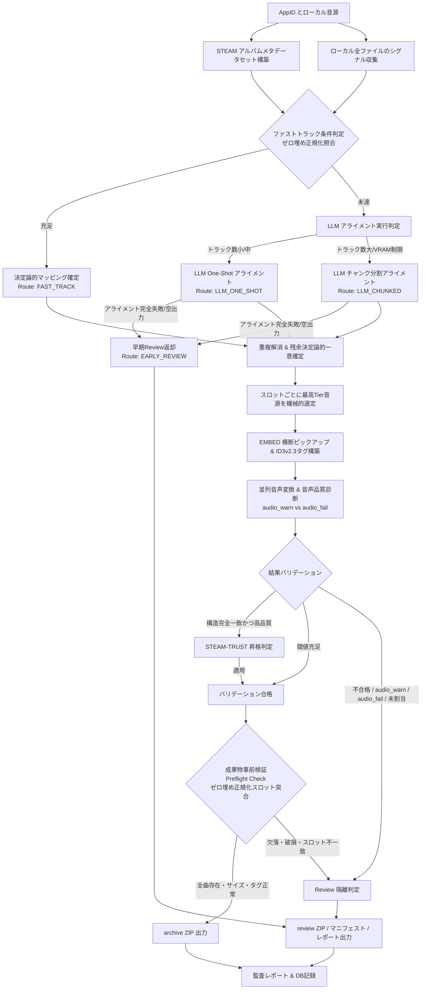
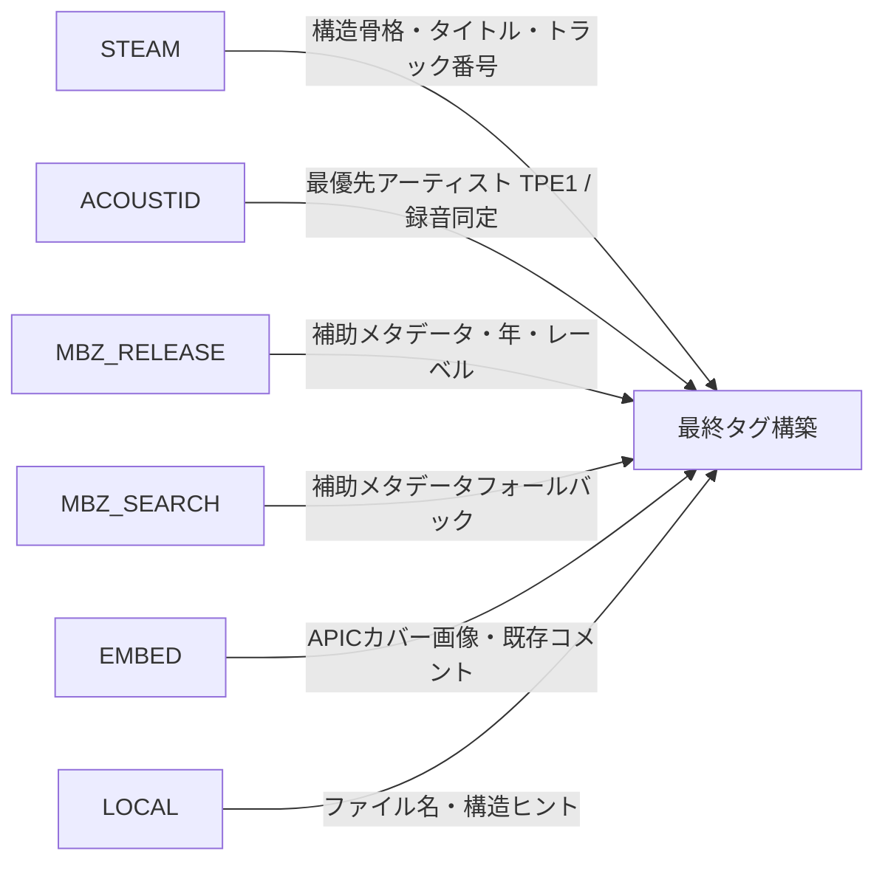
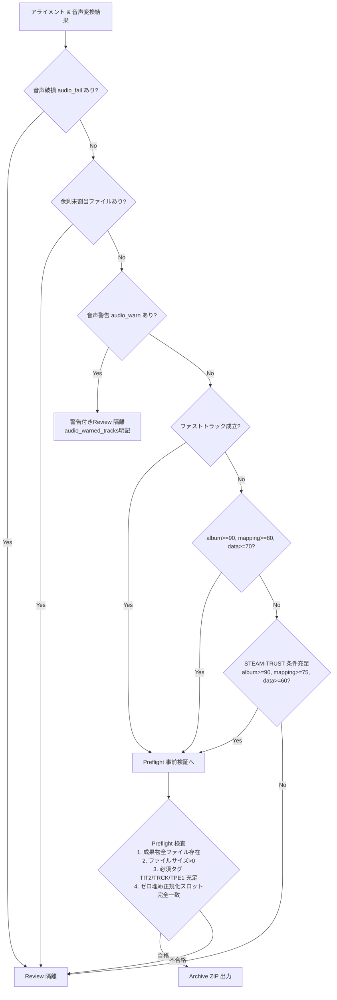

# S.S.T データフロー図

## 1. 全体データフロー

## 2. 5つの処理経路 (Processing Routes)

| 経路名 | 分岐条件 | 特徴 |
|---|---|---|
| **`FAST_TRACK`** | ローカル曲数とSteam曲数が一致し、全曲がトラック番号または正規化タイトルで1:1決定論的対応 | LLM不要で最高速・最高信頼度 |
| **`LLM_ONE_SHOT`** | ファストトラック未達で、コンテキスト上限に収まる規模のアルバム | 単一プロンプトで全曲の一括アライメントを実施 |
| **`LLM_CHUNKED`** | 楽曲数が多く単一プロンプトでのトークン超過またはTruncationの恐れがあるアルバム | チャンク分割＋並列処理でアライメント |
| **`STEAM_TRUST`** | ACOUSTID不在だが、異フォーマット統合後の一意トラック構造がSteamと完全一致 | 決定論的構造優位性により確信度100%としてArchive昇格 |
| **`REVIEW` / `EARLY_REVIEW`** | 早期中断、スロット未充足、余剰未割当ファイル、音声品質警告（`audio_warn`）、変換失敗、Preflight不一致 | 不確実な成果物を絶対にArchiveせず安全に隔離保存 |

## 3. 情報ソース関係とタグ採用階層

## 4. 判定ゲートおよび成果物事前検証 (Preflight Check)

