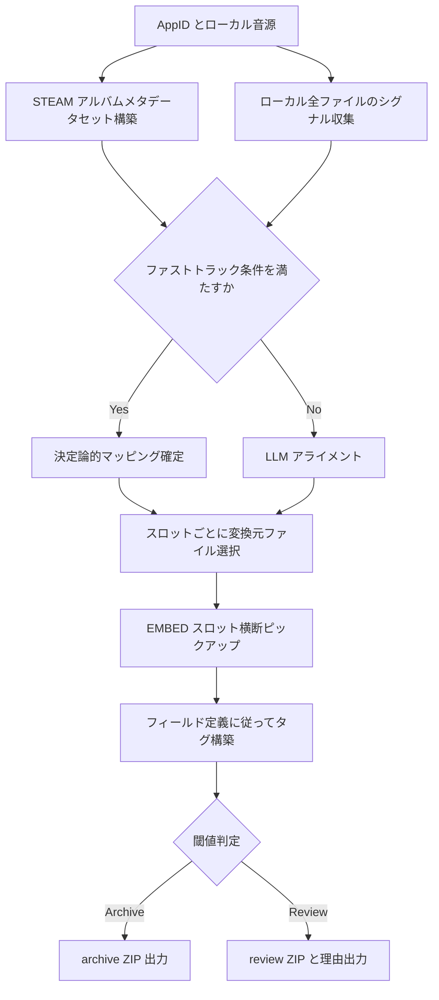
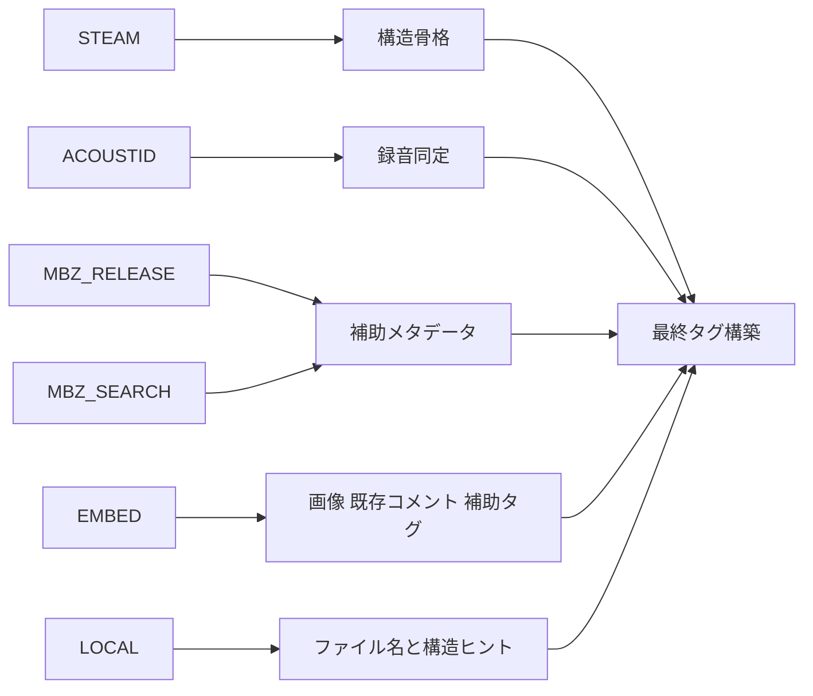
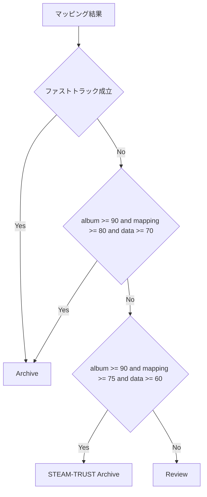

# S.S.T データフロー図

## 1. 全体フロー

```mermaid
flowchart TD
    A[AppID とローカル音源] --> B[STEAM アルバムメタデータセット構築]
    A --> C[ローカル全ファイルのシグナル収集]
    B --> D{ファストトラック条件を満たすか}
    C --> D
    D -->|Yes| E[決定論的マッピング確定]
    D -->|No| F[LLM アライメント]
    E --> G[スロットごとに変換元ファイル選択]
    F --> G
    G --> H[EMBED スロット横断ピックアップ]
    H --> I[フィールド定義に従ってタグ構築]
    I --> J{閾値判定}
    J -->|Archive| K[archive ZIP 出力]
    J -->|Review| L[review ZIP と理由出力]
```

## 2. 情報ソース関係

```mermaid
flowchart LR
    S[STEAM] --> T[構造骨格]
    A[ACOUSTID] --> U[録音同定]
    R[MBZ_RELEASE] --> V[補助メタデータ]
    M[MBZ_SEARCH] --> V
    E[EMBED] --> W[画像 既存コメント 補助タグ]
    L[LOCAL] --> X[ファイル名と構造ヒント]
    T --> Y[最終タグ構築]
    U --> Y
    V --> Y
    W --> Y
    X --> Y
```

## 3. 判定ゲート

```mermaid
flowchart TD
    A[マッピング結果] --> B{ファストトラック成立}
    B -->|Yes| C[Archive]
    B -->|No| D{album >= 90 and mapping >= 80 and data >= 70}
    D -->|Yes| C
    D -->|No| E{album >= 90 and mapping >= 75 and data >= 60}
    E -->|Yes| F[STEAM-TRUST Archive]
    E -->|No| G[Review]
```