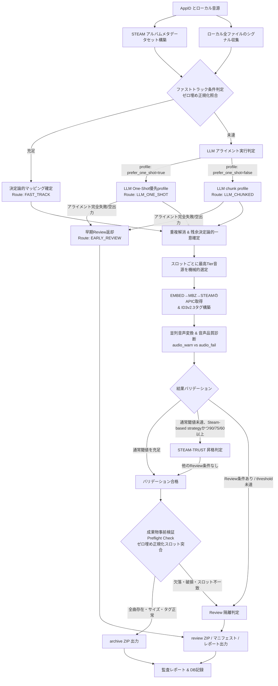
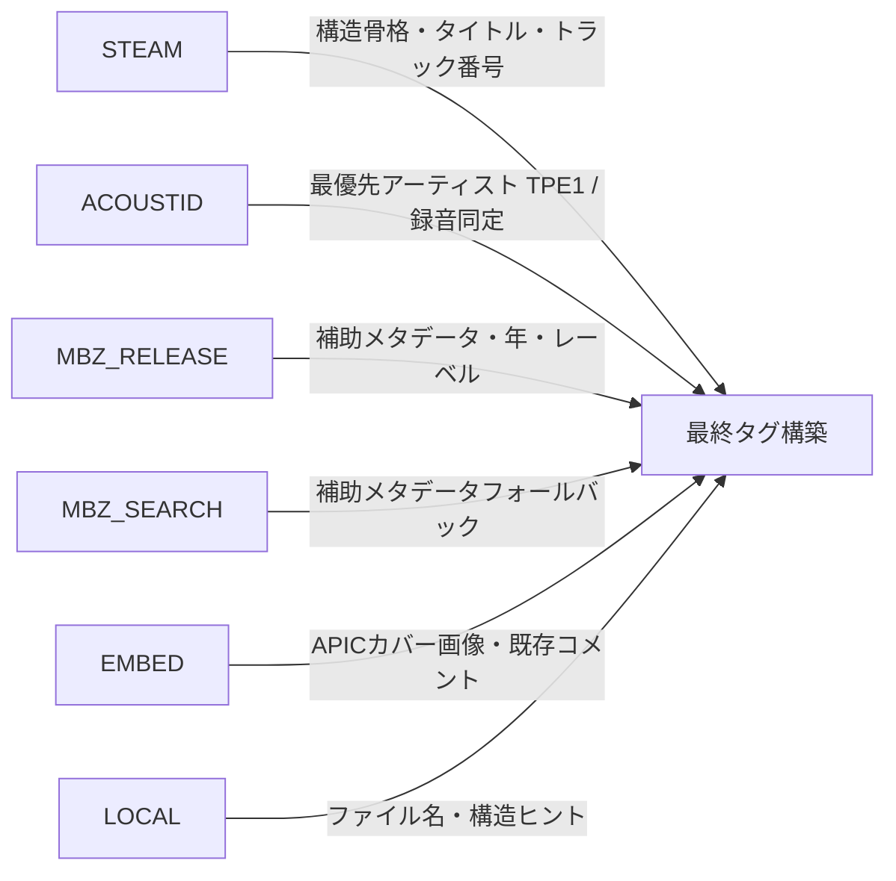
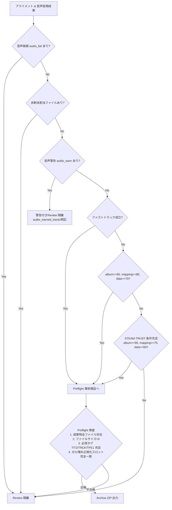

# S.S.T データフロー図

## 1. 全体データフロー

```mermaid
flowchart TD
    A[AppID とローカル音源] --> B[STEAM アルバムメタデータセット構築]
    A --> C[ローカル全ファイルのシグナル収集]
    B --> D{ファストトラック条件判定<br/>ゼロ埋め正規化照合}
    C --> D
    
    %% Route 1: FAST_TRACK
    D -->|充足| E1[決定論的マッピング確定<br/>Route: FAST_TRACK]
    
    %% LLM Routes
    D -->|未達| F[LLM アライメント実行判定]
    F -->|profile: prefer_one_shot=true| E2[LLM One-Shot優先profile<br/>Route: LLM_ONE_SHOT]
    F -->|profile: prefer_one_shot=false| E3[LLM chunk profile<br/>Route: LLM_CHUNKED]
    
    %% Early Review
    E2 -->|アライメント完全失敗/空出力| ER[早期Review返却<br/>Route: EARLY_REVIEW]
    E3 -->|アライメント完全失敗/空出力| ER
    
    %% Post Alignment
    E1 --> G[重複解消 & 残余決定論的一意確定]
    E2 --> G
    E3 --> G
    
    G --> H[スロットごとに最高Tier音源を機械的選定]
    H --> I[EMBED→MBZ→STEAMのAPIC取得<br/>& ID3v2.3タグ構築]
    I --> J[並列音声変換 & 音声品質診断<br/>audio_warn vs audio_fail]
    
    %% Validation & STEAM-TRUST
    J --> K{結果バリデーション}
    K -->|通常閾値を充足| V_OK[バリデーション合格]
    K -->|通常閾値未達、Steam-based strategyかつ90/75/60以上| ST[STEAM-TRUST 昇格判定]
    ST -->|他のReview条件なし| V_OK
    K -->|Review条件あり / threshold未達| REV[Review 隔離判定]
    
    %% Preflight Check
    V_OK --> PF{成果物事前検証<br/>Preflight Check<br/>ゼロ埋め正規化スロット突合}
    PF -->|全曲存在・サイズ・タグ正常| ARCH[archive ZIP 出力]
    PF -->|欠落・破損・スロット不一致| REV
    
    ER --> REV_OUT[review ZIP / マニフェスト / レポート出力]
    REV --> REV_OUT
    ARCH --> REP[監査レポート & DB記録]
    REV_OUT --> REP
```

FAST-TRACK では、ローカル埋め込み画像がない場合にだけアート専用 MBZ_SEARCH を遅延実行する。AcoustID と LLM は呼び出さず、検索結果は APIC 取得専用でタグメタデータには流用しない。MBZ 画像が得られない場合は Steam 画像候補へ進む。

## 2. 実行route・validator経路・終端結果

`processing_route`は実行profileの選択を表し、実際のLLM request回数や最終結果とは別です。One-Shot優先profileでもtoken budget等により内部でsegment分割される場合があります。

| 名称 | 分類 | 条件・意味 |
| --- | --- | --- |
| **`FAST_TRACK`** | 実行route (`processing_route`) | Steam slotとlocal fileが決定論的に1:1対応し、LLMを迂回 |
| **`LLM_ONE_SHOT`** | 実行route (`processing_route`) | execution profileの`prefer_one_shot=true`。tier境界はConfig由来。request数が必ず1回とは限らない |
| **`LLM_CHUNKED`** | 実行route (`processing_route`) | execution profileの`prefer_one_shot=false`。chunk sizeはtoken budget等で調整 |
| **`STEAM_TRUST`** | validator昇格経路 | Steam-based strategyかつalbum/mapping/data confidenceが90/75/60以上。通常thresholdの代替条件で、他のReview条件は上書きしない |
| **`REVIEW`** | 終端結果 | validatorまたはArchive preflightのReview条件が適用された結果 |
| **`EARLY_REVIEW`** | 早期終端結果 (`review_phase`) | alignment後の通常validatorを通らずにReview成果物を生成 |
| **`SKIP_NO_AUDIO`** | スキャン結果 | 音声ファイルがないため処理をスキップ |
| **`ERROR`** | 終端結果 | 致命的エラーを記録 |

## 3. 情報ソース関係とタグ採用階層

```mermaid
flowchart LR
    S[STEAM] -->|構造骨格・タイトル・トラック番号| Y[最終タグ構築]
    A[ACOUSTID] -->|最優先アーティスト TPE1 / 録音同定| Y
    R[MBZ_RELEASE] -->|補助メタデータ・年・レーベル| Y
    M[MBZ_SEARCH] -->|補助メタデータフォールバック| Y
    E[EMBED] -->|APICカバー画像・既存コメント| Y
    L[LOCAL] -->|ファイル名・構造ヒント| Y
```

## 4. 判定ゲートおよび成果物事前検証 (Preflight Check)

```mermaid
flowchart TD
    M[アライメント & 音声変換結果] --> A{音声破損 audio_fail あり?}
    A -->|Yes| R[Review 隔離]
    A -->|No| B{余剰未割当ファイルあり?}
    B -->|Yes| R
    B -->|No| C{音声警告 audio_warn あり?}
    C -->|Yes| RAW[警告付きReview 隔離<br/>audio_warned_tracks明記]
    C -->|No| D{ファストトラック成立?}
    D -->|Yes| P[Preflight 事前検証へ]
    D -->|No| E{album>=90, mapping>=80, data>=70?}
    E -->|Yes| P
    E -->|No| F{STEAM-TRUST 条件充足<br/>album>=90, mapping>=75, data>=60?}
    F -->|Yes| P
    F -->|No| R
    
    P --> G{Preflight 検査<br/>1. 成果物全ファイル存在<br/>2. ファイルサイズ>0<br/>3. 必須タグ TIT2/TRCK/TPE1 充足<br/>4. ゼロ埋め正規化スロット完全一致}
    G -->|合格| ARC[Archive ZIP 出力]
    G -->|不合格| R
```

Validatorのconfidence閾値、割当・タグ整合性条件、音声条件によるReview原因一覧は [LOGIC.md §2.9](LOGIC.md) を参照してください。Archive preflightは出力path、実ファイルの存在と非空サイズ、必須タグ、Steam slot集合の一致を再確認します。
